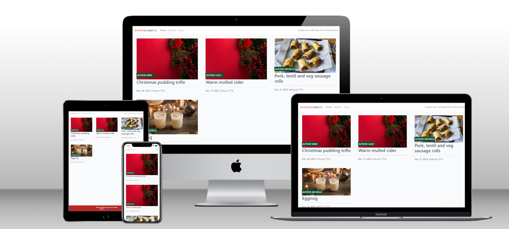

# Christmas Creations Blog

This is a blog where fans of all things Christmas, can share their recipes and craft ideas. Whilst also browsing and picking up new ideas from other users.



## [View the live website here](https://christmas-creations.herokuapp.com/)
---

## Contents
* [Introduction](#introduction)
* [User Stories](#user-stories)
* [Design](#design)
* [Technologies Used](#technologies-used)
* [Deployment](#deployment)
  * [Deploying on Heroku](#deploying-on-heroku)
  * [Forking the Repository](#forking-the-repository)
  * [Creating a Clone](#creating-a-clone)
* [Credits](#credits)
  * [Code](#code)
  * [Content](#content)
* [Features to implement in the future](#features-to-implement-in-the-future)


## Introduction

The aim of this project is to build a Full-Stack site based on business logic used to control a centrally-owned dataset. I will set up an authentication mechanism and provide role-based access to the site's data or other activities based on the dataset.

This project is a blog site dedicated to Christmas recipes and craft ideas. Registered users can share their favourite seasonal dishes, drinks and tips for decorating. They can edit and delete their own posts when logged in, or comment on and like other posts, if they wish. 

## User stories

- Site pagination: As a Site User I can view a paginated list of posts so that I can easily select a post to view
- View post list: As a Site User I can view a list of posts so that I can select one to read
- Open a post: As a Site User I can click on a post so that I can read the full text
- View likes: As a Site User / Admin I can view the number of likes on each post so that I can see which is the most popular or viral
- View comments: As a Site User / Admin I can view comments on an individual post so that I can read the conversation
- Account registration: As a Site User I can register an account so that I can comment and like
- Comment on a post: As a Site User I can leave comments on a post so that I can be involved in the conversation
- Like / Unlike: As a Site User I can like or unlike a post so that I can interact with the content
- Manage posts: As a Site Admin I can create, read, update and delete posts so that I can manage my blog content
- Create drafts: As a Site Admin I can create draft posts so that I can finish writing the content later
- Add post: As a Site User I can create a new post so that I can add to the blog content
- Edit and update post: As a Site User I can edit my post so that I can amend any errors and and make updates
- Delete post: As a Site User I can delete my post so that it is no longer visible on the blog

## Design
The site has a simple and clear design, making it easy and enjoyable to navigate through.

### Colour Scheme
The colour scheme was chosen with traditional christmas colours of warm reds and greens in mind, using hues of grey and white to establish a contrast for background and text to enhance user accessibility.

Image of colour palette made on [Coolors](https://coolors.co/)


### Images
There is one placeholder image of a green christmas plant on a red background. Other images will be uploaded by users and admin when creating a post.

<details>
 <summary>Placeholder Image</summary>


</details>

## Technologies Used

- HTML
- CSS
- JavaScript
- Python
- Django

- ElephantSQL
- Heroku
- Git
- Github

## Deployment

This project was developed using a [GitPod](https://gitpod.io/) workspace. The code was commited to [Git](https://git-scm.com/) and pushed to [GitHub](https://github.com/) using the terminal.

### Deploying on Heroku
To deploy this page to Heroku from its GitHub repository, the following steps were taken:

1. Create the Heroku App:
    - Select "Create new app" in [Heroku](https://dashboard.heroku.com/apps).
    - Choose a unique name for your app and select the location nearest to you.
    - Click "Create App".

2. Attach the Postgres database:
    - In the Resources tab, under add-ons, type in Postgres and select the Heroku Postgres option.

3. Prepare the environment and settings.py file:
    - In the Settings tab, click on Reveal Config Vars and copy the url next to DATABASE_URL.
    - In your GitPod workspace, create an env.py file in the main directory. 
    - Add the DATABASE_URL value and your chosen SECRET_KEY value to the env.py file.
    - Add the SECRET_KEY value to the Config Vars in Heroku.
    - Update the settings.py file to import the env file and add the SECRETKEY and DATABASE_URL file paths.
    - Update the Config Vars with the Cloudinary url, adding into the settings.py file also.
    - In settings.py add the following sections:
        - Cloudinary to the INSTALLED_APPS list
        - STATICFILE_STORAGE
        - STATICFILES_DIRS
        - STATIC_ROOT
        - MEDIA_URL
        - DEFAULT_FILE_STORAGE
        - TEMPLATES_DIR
        - Update DIRS in TEMPLATES with TEMPLATES_DIR
        - Update ALLOWED_HOSTS with ['app_name.heroku.com', 'localhost']

4. Store Static and Media files in Cloudinary and Deploy to Heroku:
    - Create three directories in the main directory; media, storage and templates.
    - Create a file named "Procfile" in the main directory and add the following:
        - web: gunicorn project-name.wsgi
    - Log in to Heroku using the terminal heroku login -i.
    - Then run the following command: **heroku git:remote -a your_app_name_here** and replace your_app_name_here with the name of your Heroku app. This will link the app to your Gitpod terminal.
    - After linking your app to your workspace, you can then deploy new versions of the app by running the command **git push heroku main** and your app will be deployed to Heroku.


### Forking the Repository
By forking the GitHub Repository we make a copy of the original repository on our GitHub account to view and/or make changes without affecting the original repository by using the following steps...

1. Log into [GitHub](https://github.com/login) or [create an account](https://github.com/join).
2. Locate the [GitHub Repository](https://github.com/MichelleCorrigan/DjangoProject).
3. At the top of the repository, on the right side of the page, select "Fork"
4. You should now have a copy of the original repository in your GitHub account.

### Creating a Clone
How to run this project locally:
1. Install the [GitPod Browser](https://www.gitpod.io/docs/browser-extension/) Extension for Chrome.
2. After installation, restart the browser.
3. Log into [GitHub](https://github.com/login) or [create an account](https://github.com/join).
4. Locate the [GitHub Repository](https://github.com/MichelleCorrigan/DjangoProject).
5. Click the green "GitPod" button in the top right corner of the repository.
This will trigger a new gitPod workspace to be created from the code in github where you can work locally.

How to run this project within a local IDE, such as VSCode:

1. Log into [GitHub](https://github.com/login) or [create an account](https://github.com/join).
2. Locate the [GitHub Repository](https://github.com/MichelleCorrigan/DjangoProject).
3. Under the repository name, click "Clone or download".
4. In the Clone with HTTPs section, copy the clone URL for the repository.
5. In your local IDE open the terminal.
6. Change the current working directory to the location where you want the cloned directory to be made.
7. Type 'git clone', and then paste the URL you copied in Step 3.
```
git clone https://github.com/USERNAME/REPOSITORY
```
8. Press Enter. Your local clone will be created.

Further reading and troubleshooting on cloning a repository from GitHub [here](https://docs.github.com/en/free-pro-team@latest/github/creating-cloning-and-archiving-repositories/cloning-a-repository)


## Credits

### Code
- Code Institute student template: [gitpod full template](https://github.com/Code-Institute-Org/gitpod-full-template)
- Code Institutes syllabus
- John Elder's series of videos 'Create a simple django blog' on [YouTube](https://www.youtube.com/@Codemycom)

References used:

- Stack Overflow
- Slack
- Bootstrap
- Django Docs
- Summernote GitHub Docs
- Cripsy Forms Docs

### Content

- Recipes and their images were taken from [BBC Food](https://www.bbc.co.uk/food)
- Placeholder image from [Unsplash](https://unsplash.com/s/photos/christmas-background)

## Features to Implement in the future

- Expand messaging system to display success message when comment added, and error message when user submits an empty comment form
- Add blog categories for seperation eg. a recipe category, table-settings category etc
- Add a countdowm timer to display time left untill Christmas Day of the current year 

## Testing

Testing information can be found in a separate [testing file] that I haven't created yet...

## Issues and Bugs 

Many...